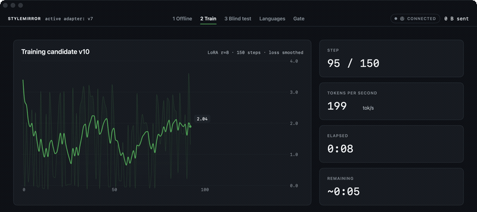

# Adapt

Adapt is a Swift library that lets an iOS or macOS app ship a language model that gradually gets better at its specific user, entirely on-device. The app collects training signal, Adapt trains a LoRA adapter on it locally, evaluates the result on-device, and promotes the new adapter only if it beats the one in use. No server, no Python, no data leaving the machine.



Above: the demo app's training screen — loss curve, tokens/sec, step count, time remaining. `Examples/StyleMirror` currently drives those numbers from a scripted engine rather than from real training; [docs/demo.md](docs/demo.md) says which parts are real and which are staged.

## Why this exists

Apple's Foundation Models framework accepts custom LoRA adapters, but you train them offline on a Mac with Apple's Python toolkit. MLX Swift can train LoRA on-device, but ships as example code. What's missing is the product around the training loop: collecting signal, running training when the device can afford it, deciding whether the new adapter is actually better, rolling back when it isn't. Python can't fill that gap — it doesn't run on iOS, and the work is mostly OS integration: background tasks, thermal state, battery, Keychain, CloudKit. Adapt is that layer, plus the training and inference under it.

## Status

Milestone 1 of six is done and externally reviewed. Built and working today:

- **AdaptCore** — shared types. Adapter metadata never contains user text, only counts, date ranges and metric values.
- **AdaptRegistry** — versioned adapter store. Atomic promote and rollback (rollback is a pointer flip; weights are never rewritten), SHA-256 integrity digests. Crash-safe: a process killed mid-checkpoint leaves the store readable.
- **AdaptTrain** — interruption-safe LoRA training over MLX. Checkpoints every N steps; interrupting and resuming reproduces the uninterrupted run's loss curve and final weights to within 1e-5. It implements its own AdamW, because MLX's optimizer state cannot be serialized through its public API and resume would otherwise be impossible.
- **AdaptInference** — loads the active adapter, streams generation, and hot-swaps adapters without reloading the model.
- **adapt-cli** — `train`, `generate`, `inspect`, `promote` from the terminal.

Measured on an M5 Pro:

- 87 tests, all offline — no network, no model downloads in the test suite.
- Training Qwen3-4B-4bit, rank 8, 16 adapted layers, 300 steps: 2 min 10 s, 3.1 GB peak memory, 73 tokens/sec.
- Adapter hot-swap: 8 ms for a rank-8 adapter.

Not built yet:

- Replay buffer with PII scrubbing and a privacy budget (M2).
- The on-device evaluation gate that decides promotion (M3). Until it exists, promotion is manual.
- Background scheduling and iOS support (M4).
- The `@Personalizable` macro (M5).
- Encrypted CloudKit sync between devices (M6).

### Known limitation: generation quality

Generation quality is usable but not finished.

A controlled experiment with pre-registered pass criteria failed on all three test prompts in two sampling configurations: a rank-8 adapter reproduced the target voice's opening and sign-off, then repeated itself. Adding a repetition penalty did not fix it — the model simply cycled through variants of the sign-off instead of repeating it exactly.

The cause was that training and generation both bypassed the model's chat template, so the model was continuing a document rather than answering a question. Both paths now go through one shared formatter, the convention used is recorded in the adapter's metadata, and a session refuses an adapter trained under a different convention rather than generating subtly wrong output. Measured after the change on Qwen3-4B-4bit at 100 steps: loss 9.63 → 1.49, and the base model produces a chat-conditioned reply instead of placeholder templates.

Two things are still open. Training 300 steps on 50 examples collapses the loss to 0.001 and bleeds training vocabulary into unrelated answers; early stopping belongs to the evaluation gate in M2/M3, so for now keep the step count low. And Qwen3's default chat template enables a reasoning trace, which is fine for a library but wrong for a side-by-side comparison, so the demo's blind test is not ready.

## Quickstart

```bash
git clone <repo> && cd swift-adapt
swift build
swift test          # 87 tests, offline

# Train an adapter on 50 example replies in a distinctive voice
swift run -c release adapt-cli train \
  --data Tools/adapt-cli/Fixtures/nix-caldera-style.jsonl \
  --steps 100 \
  --model mlx-community/Qwen3-0.6B-4bit \
  --registry .build/demo-registry \
  --promote

# Compare base model against the adapter, side by side
swift run -c release adapt-cli generate \
  --prompt "Decline a meeting that conflicts with your watch." \
  --model mlx-community/Qwen3-0.6B-4bit \
  --registry .build/demo-registry

swift run adapt-cli inspect --registry .build/demo-registry
```

## Library usage

```swift
let session = try await AdaptSession(
    model: .id("mlx-community/Qwen3-4B-4bit"),
    lineage: emailStyle,
    registry: registry,
    tokenizerLoader: tokenizerLoader   // you supply this — see below
)

for try await chunk in session.generate(prompt: draft) {
    print(chunk, terminator: "")
}

try await session.reload()   // picks up a newly promoted adapter; no model reload
```

The session loads the lineage's active adapter, verifies its digest, and falls back to the base model when there is no active version. Model download and tokenizer loading are injected rather than built in, which is why the library itself has no networking — `adapt-cli` supplies the Hugging Face implementations, and an app that ships weights in its bundle supplies neither.

Training data is JSONL, one object per line. `prompt` and `completion` are required; `source` and `weight` are optional.

## Requirements

macOS 15+ or iOS 18+ (iOS support lands with M4), Apple Silicon, Swift 6.3.

Dependencies: mlx-swift, mlx-swift-lm, swift-argument-parser. The library modules pull in no networking; the CLI adds Hugging Face packages for model download. That separation is deliberate — privacy is structural, not a setting. An app that links only the library has nothing that could send data anywhere.

## Design

Three rules the code enforces rather than promises. An adapter that is worse than the current one is never shipped; once the evaluation gate (M3) exists, promotion requires a measured win, and rollback is always a pointer flip away. Training runs only when the user won't notice; the scheduler is M4 work, but the training core is already built to be interrupted at any step and resumed without drift. And Adapt is not tied to one model — anything MLX can load works.

## Demo

`Examples/StyleMirror` is a macOS app built for a live five-minute demo. It currently runs on a scripted engine, not real training. The walkthrough is in [docs/demo.md](docs/demo.md).

## License

Apache-2.0. See [LICENSE](LICENSE).
