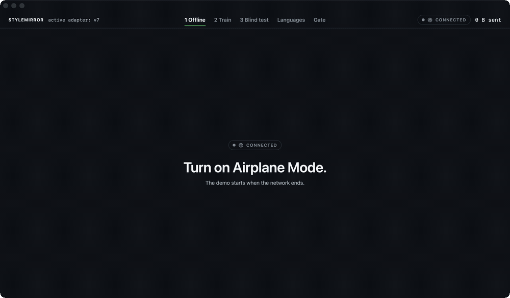
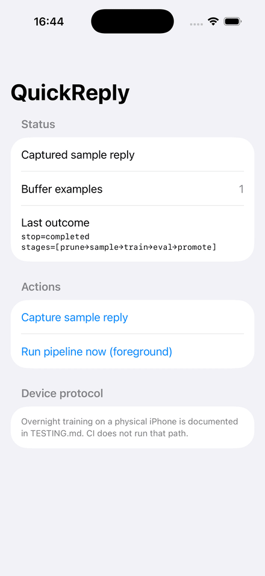

# StyleMirror: the demo, screen by screen

`Examples/StyleMirror` is a macOS SwiftUI app built to be performed live in about five minutes. It runs on the real library: training, generation and the adapter registry are the ones in `Sources/`. If the model or the seeded registry is missing it falls back to a scripted engine, and says so — the status strip marks the run `SCRIPTED` in red, because which engine is running changes what every number on screen means.

The version history comes from `scripts/seed-demo-registry.sh`, which trains seven adapters in seven separate processes, each resuming from the one before. Nothing in the registry is a fixture.

## The screens at a glance

Offline, the gate refusing night seven, the rollback, and the multilingual screen. Small labels lose legibility at this width — the full-size PNGs are in `docs/images/`.

## On iOS

`Examples/QuickReply` on an iPhone 17 Pro simulator. It is a developer skeleton, not a designed app, and its training stage is a no-op by default so the target builds without bundling a multi-gigabyte model. What it does prove is that the machinery runs on iOS: capturing a reply writes to the real SQLite buffer (the count goes to 1), and the nightly pipeline completes all five stages — `prune → sample → train → eval → promote`. The one failure on screen, `BGTaskSchedulerErrorDomain error 3`, is the simulator refusing background-task registration; that path needs a physical device, per `Examples/QuickReply/TESTING.md`.

## Act 1: airplane mode

The presenter switches on airplane mode in front of the audience before anything else happens. The app treats offline as the feature, not a degraded state, and a "0 B sent" counter stays on screen for the rest of the demo. That counter is a real measurement, not a printed zero: the app routes all outbound traffic through a single chokepoint, and it never calls it. The screen's argument: you don't have to trust a privacy policy when there is no network path to police.

## The night that made it worse

This is the screen the demo exists for, and it was not planned. Seeding the registry with seven real overnight runs produced this held-out loss curve: `4.06 → 3.70 → 3.38 → 3.42 → 3.19 → 3.12 → 3.34`. Night seven came out **0.22 nats worse than night six**, on ordinary mail, with nothing sabotaged — and it became the active adapter anyway, because promotion is manual until the evaluation module exists.

So the timeline at the bottom is evidence rather than decoration: worse loss sits higher, and night seven kinks upward. The panel states what a gate would have decided, from the measurements already recorded in the registry.

Then it is undone. Rollback is a pointer flip in the registry — no weights are rewritten — and the screen prints the duration it measured rather than a number someone typed. A staged failure invites the suspicion that it was staged; this one is in the data, and the fix is a capability that already exists.

The original scene — twenty examples of ALL-CAPS pirate slang, refused by the same comparison — is still there behind the second tab. It reads better once the audience has watched the check catch something real.

## The blind test: what the 91 seconds actually were

The blind test now finishes in the app — 2.09 seconds for the first round, 1.48 for a warm one — and the diagnosis is worth keeping, because every number I first reported about it pointed the wrong way.

The screen appeared to be generating for 91 seconds while a smoke harness did the same work in 3.8. It was not generating at all. Launching with `--screen blind` raced the state load: the screen's one-shot task asked for a round before the example IDs and active adapter were populated, hit an early return, and never retried. The indicator spun, the elapsed clock ran, and no model was ever loaded — about 80 MB resident after 90 seconds is the tell I should have read sooner. "Slow" and "never started" look identical behind an indeterminate spinner, which is the argument for the indicator being determinate wherever counts exist.

Two changes: the screen re-tasks when the active adapter appears and the round preparation self-heals its inputs, with a guard so the two paths cannot stack; and the progress handler became `async`, awaited between units, so counts paint while work is in flight instead of after it.

## Not ready yet: the multilingual screen

**Code-switching** is no longer performed, and its claim has been retired rather than tuned. The screen renders and generates for real; the result does not support "one adapter learned your voice in every language". English is fine. Spanish becomes coherent once a repetition penalty is applied. Russian degenerates under every sampling setting tried — temperature 0 to 0.4, top-p 0.85 to 0.9, penalty 1.2 to 1.35 — which changes the failure mode without producing a voice. A rank-8 adapter over a corpus with roughly a fifth of its examples per non-English language is a capacity limit, and fixing it means re-training the seven nights and re-deriving every number in this document. That was not worth doing for one screenshot, so the screen now shows the real output and states the boundary.

Session caching and a yield between progress events fixed both symptoms **in the smoke harness** and neither fixed the app, which is the whole lesson: a fix verified only where the bug does not reproduce is not a fix. The real cause was only visible once the app itself was instrumented.
