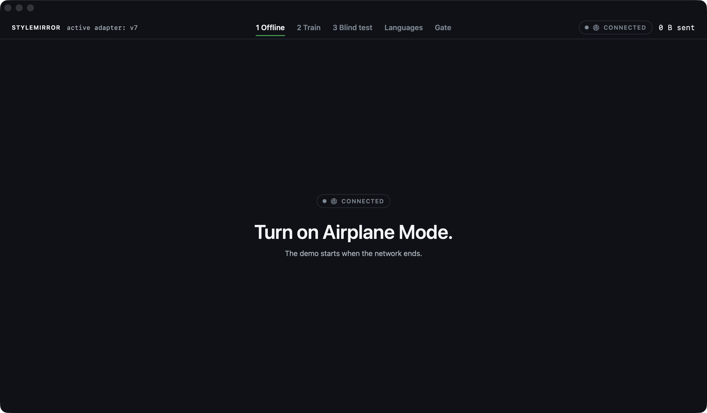
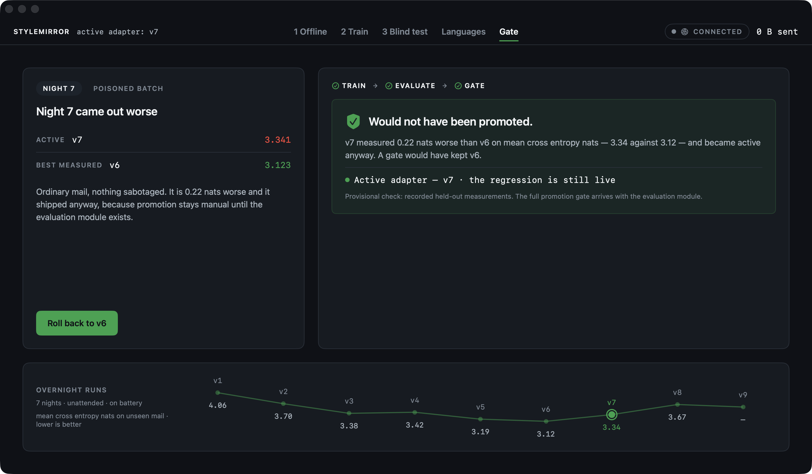
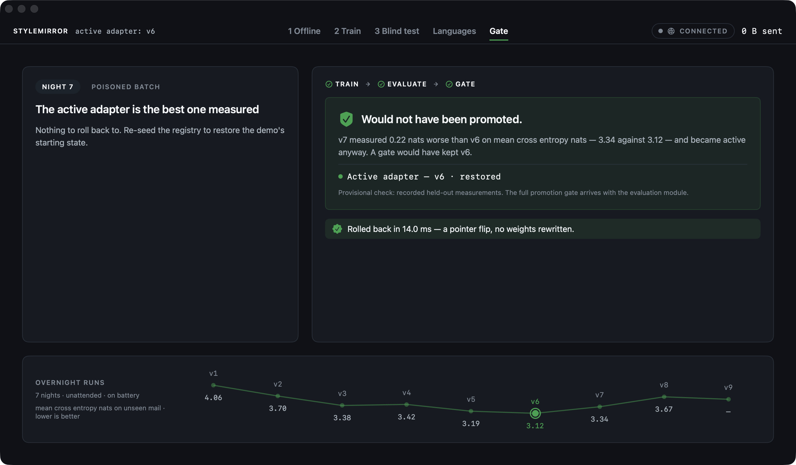
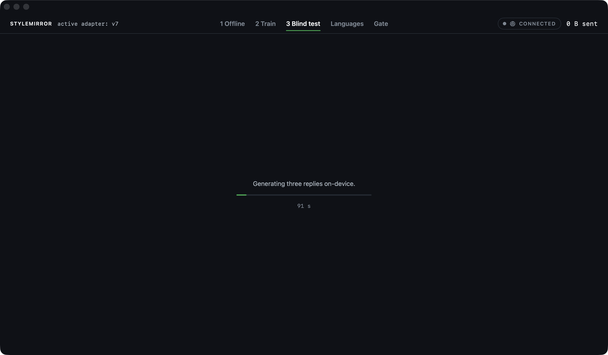
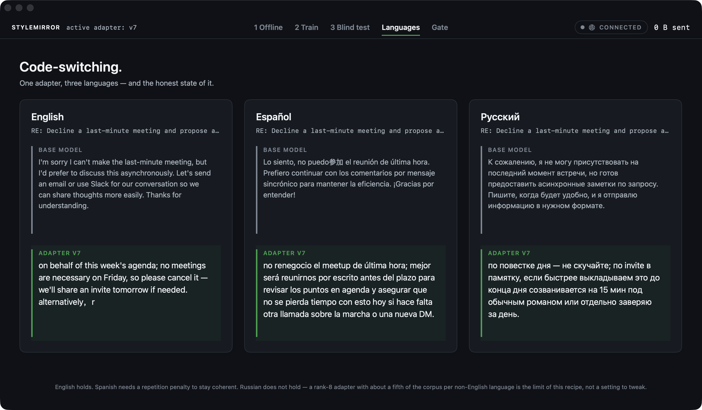

# StyleMirror: the demo, screen by screen

`Examples/StyleMirror` is a macOS SwiftUI app built to be performed live in about five minutes. It runs on the real library: training, generation and the adapter registry are the ones in `Sources/`. If the model or the seeded registry is missing it falls back to a scripted engine, and says so — the status strip marks the run `SCRIPTED` in red, because which engine is running changes what every number on screen means.

The version history comes from `scripts/seed-demo-registry.sh`, which trains seven adapters in seven separate processes, each resuming from the one before. Nothing in the registry is a fixture.

## Act 1: airplane mode

The presenter switches on airplane mode in front of the audience before anything else happens. The app treats offline as the feature, not a degraded state, and a "0 B sent" counter stays on screen for the rest of the demo. That counter is a real measurement, not a printed zero: the app routes all outbound traffic through a single chokepoint, and it never calls it. The screen's argument: you don't have to trust a privacy policy when there is no network path to police.

## The night that made it worse

This is the screen the demo exists for, and it was not planned. Seeding the registry with seven real overnight runs produced this held-out loss curve: `4.06 → 3.70 → 3.38 → 3.42 → 3.19 → 3.12 → 3.34`. Night seven came out **0.22 nats worse than night six**, on ordinary mail, with nothing sabotaged — and it became the active adapter anyway, because promotion is manual until the evaluation module exists.

So the timeline at the bottom is evidence rather than decoration: worse loss sits higher, and night seven kinks upward. The panel states what a gate would have decided, from the measurements already recorded in the registry.

Then it is undone. Rollback is a pointer flip in the registry — no weights are rewritten — and the screen prints the duration it measured rather than a number someone typed. A staged failure invites the suspicion that it was staged; this one is in the data, and the fix is a capability that already exists.

The original scene — twenty examples of ALL-CAPS pirate slang, refused by the same comparison — is still there behind the second tab. It reads better once the audience has watched the check catch something real.

## The blind test

One incoming email, three candidate replies: the base model, the adapter, and one of the user's own replies. The audience guesses which is human.

Two rules make this worth running. Both models get the identical instruction, including the same length constraint — an earlier version asked them differently and the base model wrote 526 characters where the adapter wrote 59, which identified it from across the room without anyone reading a word. And the human reply comes from the held-out slice, mail the adapter was never trained on; otherwise the comparison is degenerate, because the model has been trained to emit that exact text.

## Same voice, three languages

The same adapter answers in English, Spanish and Russian. The base model's reply is rendered dimmer and smaller than the adapter's on purpose — the layout is making the argument. The seven nights include Spanish and Russian mail in a 60/20/20 mix, so "your mail was already multilingual, so the adapter is too" is a claim about the training data rather than a slogan.
